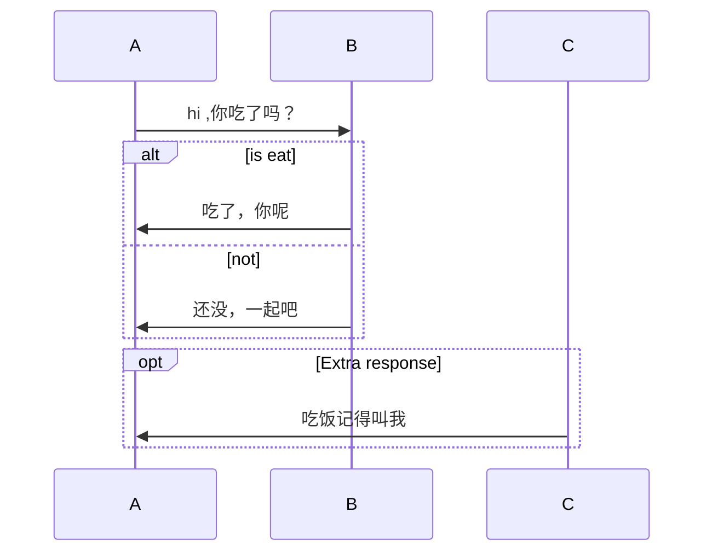
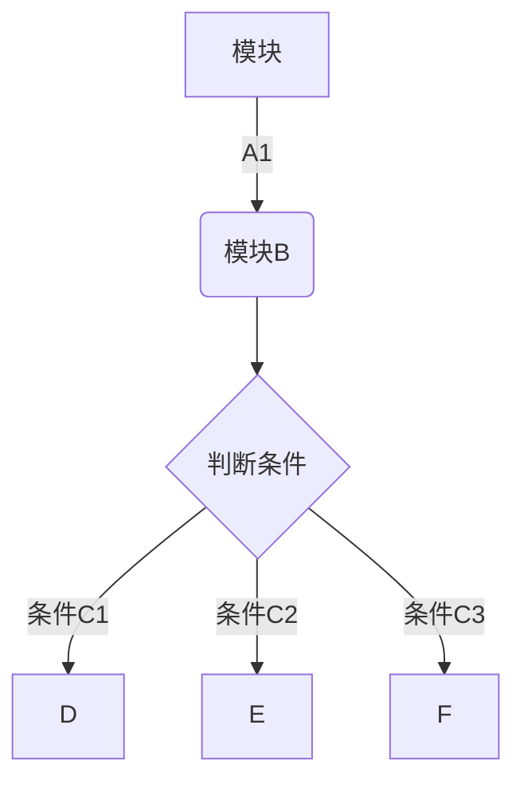
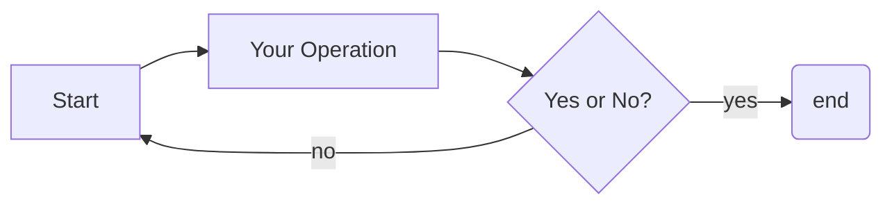
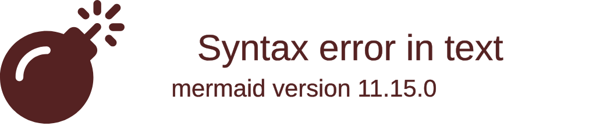
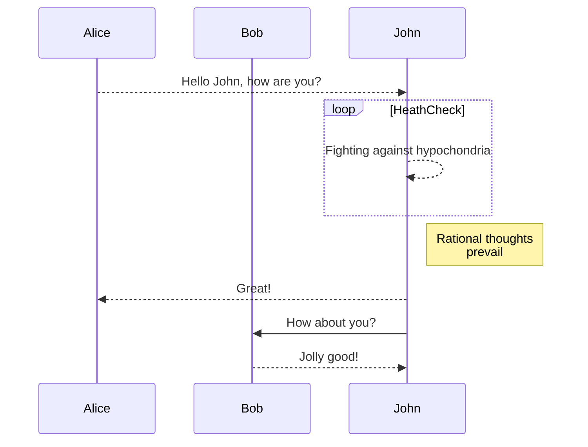
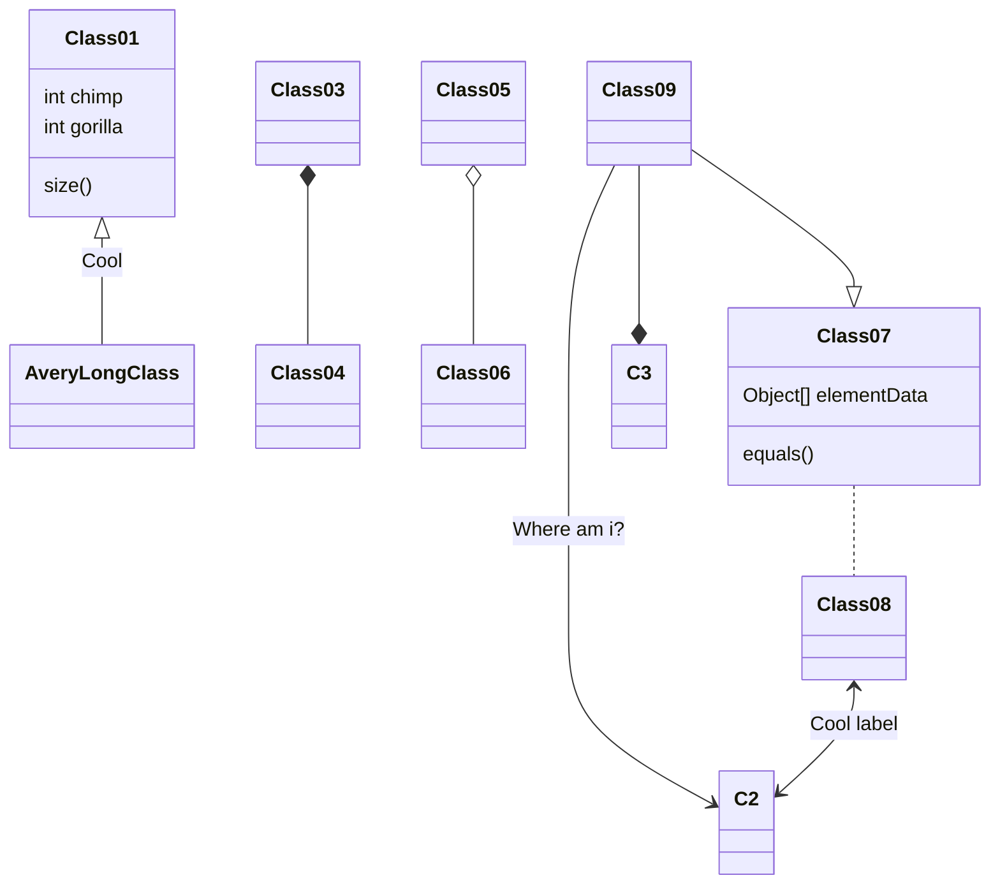

​```flow
st=>start: Start
op=>operation: Your Operation
cond=>condition: Yes or No?
e=>end

st->op->cond
cond(yes)->e
cond(no)->op
​```



```math
e^{i\pi} + 1 = 0
```



Basic sequence diagram





