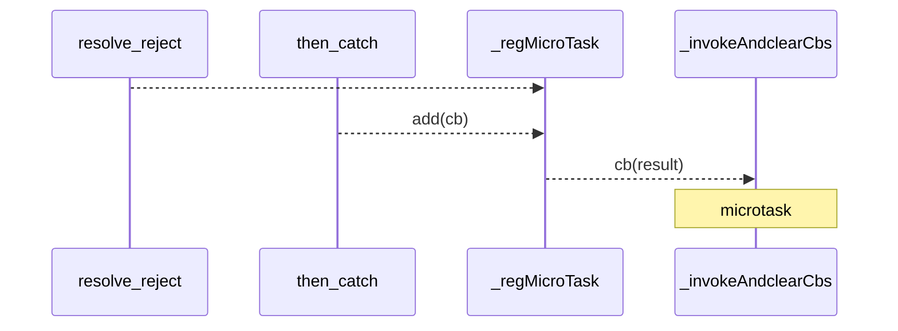

## core
- 调用链中介 : 调用者 - Promise - 被调用者
  - 调用者 调用 resolve,reject,throw
  - 被调用者使用 .then,.catch 监听
  - 调用者1~n 被调用者
  - 被调用者可以随时 listen
    - 被调用者中返回值 作为resovle 参数
      - resolve 参数为 promise 时,结果由此promise决定
  - 调用者 reject时,要求绑定catch,否则应在全局钩子处理:
    - 钩子:onunhandledrejection,onrejectionhandled
- 运行时- 微任务
  - 微任务会一直执行，直到微任务队列清空
  - 触发
    - resolve,reject
    - then,catch
  - 回调
    - microTask_ClearCbs

```js
(function () {
  var p = Promise.resolve(1);
  var startTime = +new Date(), wait = 500;

  function run(num) {
    console.log('run',num);
    const time = new Date - startTime;
    if (time < wait * 2) {
      p = p.then(run);
      return num+1;
    } else {
      console.log('run end', num,time);
    }
  }
  p.then(run);//在微任务中执行run
  console.log('setTimeout begin');
  setTimeout(() => console.log('setTimeout', new Date - startTime), wait);

})();
  ```
- 分支：resolve ，reject
  - 在一个 promise 链的代码中，如果实现其中特定步骤出错执行修复，另一部分则直接中断
    - 最终结果作为一个promise ，该promise的结果与 各部分有关

- 全局reject处理
  - [ ] rejectionhandled 什么时候调用？
    -  如果reject的事件循环中没有错误处理,那么第一次添加catchHandler，catchHandler执行结束后调用
    
```js
const map = rejectPromises;
process.onunhandledrejection = (reason,promise)=>{
  rejectPromise.add(rejectPromises,reason);
}
process.onrejectionhandled = (reason,promise)=>{
  rejectPromise.delete(promise);
}
function doSomeThingForUnhandledReject(){
  // 
  setTimeout(doSomeThingForUnhandledReject,1000);
}
```

- [实现参考](node_modules/_core-js@2.6.9@core-js/modules/es6.promise.js)

- 实现描述


  - 时序图使用
    - 对象与对象，对象间
      - 方法是对象么？
        - [] 换个方式:状态,回调
    - [ ]  时序图使用  
```js
//调用链中介
class Promise{
  //todo 全局钩子
  constructor(executor){
    this.status = 'pending';
    executor(this._resolver,this._rejector);
  }
  static resolve(arg){
    if(arg instanceof this){
      return arg;
    }
    return new this(resolve=>resolve(arg));
  }
  static reject(arg){
    return new this((resolve,reject)=>reject(arg));
  }
  _resolver(arg){
    //参数数量:1

    if(this.status !== 'pending') return;
    if(arg instance of this){
      //todo 考虑 this 继承;
      addResolveCb(arg,arg2=>this._resolver(arg2));
      addRejectCb(arg,arg2=>this._reject(arg2));
      return;
    }
    this._regClearCbs();
    this.status ='resolve';
  }
  _rejector(arg){

    if(this.status !== 'pending') return;
    this._regClearCbs();
    if(arg instance of this){
      //todo 考虑 this 继承;
      addResolveCb(arg,arg2=>this._resolver(arg2));
      addRejectCb(arg,arg2=>this._reject(arg2));
      return;
    } 

    this.status ='reject'; 
  }
  //then,catch,
  then(sucCb,failCb){
    const pre=this;
    return new this.constructor(resolve,reject){
      {
        addResolveCb(pre,result=>resolve(sucCb(result)));
        reject&&addRejectCb(pre,result=>reject(failCb(result)));
      } 
    }
  }
  catch(failCb){ 
      addRejectCb(pre,result=>reject(failCb(result)));
  }
} 
//? 微任务先后顺序？constructor 与 then,有没可能咬尾巴
  －　不会死循环: 状态只改变一次
// 画出来
```
- todo
  - 画图：包含全局钩子
  - promise 与 generator
  - [ ] promise polyfill 实现 参考